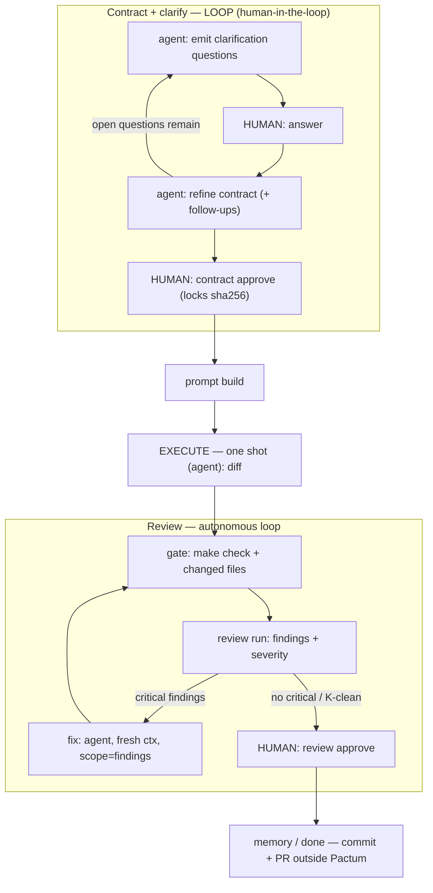

# Loop architecture design

**Status:** Draft / proposal (not yet implemented)
**Scope:** Where iteration (loops) belongs in the Pactum run pipeline, and where it
deliberately does not. Defines the target behavior for the contract, execute, and
review phases.

## Motivation

Today every Pactum stage is one-shot and human-driven. `pactum execute run`
launches exactly one agent subprocess per invocation; multiple attempts exist only
because a human re-runs the command. The config schema already *declares* iteration
limits — `clarify.max_iterations`, `clarify.max_questions_per_round`,
`review.max_rounds`, and a `budget` block — but nothing reads or enforces them.
They are placeholders for loops that do not exist yet.

This document defines where those loops should live.

## Guiding principle

> **Loop where each iteration adds new information; stay one-shot where repetition
> adds nothing.**

- **clarify** — each answer refines the contract → *loop*.
- **execute** — re-running the same prompt yields the same result → *one-shot*.
- **review → fix** — each round surfaces new findings that drive new fixes → *loop*.

Corollary — the human / machine split:

> The **human defines WHAT** (intent, captured in the contract). The **machine does
> HOW** (execute) and **self-corrects** (review loop). Human involvement front-loads
> into the contract phase and bookends at approval gates.

## Autonomy boundaries

| Phase | Iteration | Who answers / decides | Human gate |
|-------|-----------|-----------------------|------------|
| Contract + clarification | **Loop** (human-in-the-loop) | Human answers; agent generates questions + drafts contract | `contract approve --by manual` |
| Execute | **One-shot** | Agent (autonomous) | — (covered by the review loop + final review approve) |
| Review | **Loop** (autonomous) | Agent finds, agent fixes | `review approve --by manual` |

---

## Phase 1 — Contract + clarification (human-in-the-loop)

Clarification questions are **answered by the human, by definition**. They surface
intent and decisions that exist only in the human's head and cannot be inferred from
the repository. The loop does **not** reduce human involvement — it *converges
intent*.

The agent's role in this loop is to **generate good questions and draft/refine the
contract from the answers** — never to answer the questions itself.

**Loop:**

1. Agent reads the goal + repo context + prior answers.
2. Agent emits clarification questions — ambiguities only a human can resolve
   (approach choice, scope edges, priority, acceptance criteria).
3. **Human answers.**
4. Agent refines the contract draft and may emit **follow-up** questions (an answer
   revealed a new ambiguity).
5. Repeat until the agent has no further questions and the human is satisfied —
   capped by `clarify.max_iterations` / `clarify.max_questions_per_round`.
6. **Human approves:** `contract approve --by manual` (locks the contract sha256).

The value of the loop over one-shot is step 4: the agent does not dump every
question at once and never revisit — an answer can legitimately produce the next
question. That is why it is a loop, not a single round.

### Clarifications vs assumptions

The contract already has an `Assumptions` section. It is **not** a substitute for
clarification — the two are complementary:

| | Clarification | Assumption |
|---|---|---|
| Who fills it | **Human answers** | Agent **declares** its default |
| Purpose | Resolve intent only the human knows | Record what the agent will assume if not told |
| Human control | Answers directly | Sees it; may veto or **promote it to a clarification** |

An agent may state "I assume X" (assumption) — but if X is material, it must be
**raised as a clarification question to the human**, not left as a silent guess.
This keeps the human in full control of intent while letting the loop avoid stalling
on trivia the agent has honestly flagged.

---

## Phase 2 — Execute (one-shot)

One agent attempt per run. If execute produced a wrong result, the remedy is **new
information** (review findings), not re-running the same prompt. Iteration is
therefore pushed to the review loop, where each round carries new information.

**Constraint — no task decomposition.** One contract = one bounded change = one
execute. This keeps Pactum focused on *bounded changes*; large features must be
sliced into multiple contracts by the human. Decomposition (a `plan → N tasks`
stage) is explicitly **out of scope** for this design and may be revisited later.

**Allowed exception.** A single retry is acceptable only for an *infrastructure*
failure — the agent crashed or produced no diff at all — which is distinct from
"produced a result that needs improvement" (that goes to the review loop).

---

## Phase 3 — Review loop (autonomous)

**Goal:** converge code quality by iterating *find → fix → re-validate → re-review*
until no critical findings remain.

**Loop:**

1. **gate** — run validation (e.g. `make check`) and detect changed files.
2. **review run** — the reviewer agent emits findings, each with a severity.
3. If **critical** findings remain → **fix** — an executor agent fixes them, scoped
   to the findings, in a **fresh context** (only the current findings + diff, not
   the full history).
4. **re-gate + re-review.**
5. Exit when no critical findings remain → **human `review approve`.**

**Validation lives inside the loop.** The cycle is `fix → gate → review`, never
`fix → review` — so a fix that breaks the build is caught before a quality review.

### Cross-model review

The reviewer should not be the same model that wrote the code. A model reviewing its
own output shares its own blind spots, so the **review step runs a different model
than the executor** — cross-model review. With codex as the executor the review runs
claude (and vice versa); the role can also fan out to a **panel** of distinct models
that each review independently.

- **Independence.** An author model tends to rationalize its own choices; an
  independent model is a stronger critic and surfaces issues that same-model review
  misses.
- **Safe by construction.** Reviewers run read-only (the reviewer role carries no
  write/edit bypass), so running additional models as reviewers cannot mutate the
  tree — only the fix step (an executor) writes.
- **Configuration.** Reviewer model(s) are selected via per-stage `model[:effort]`,
  independently of the executor. The default reviewer should differ from the
  executor; a panel is opt-in.
- **Aggregation.** A panel's findings are merged and de-duplicated before the fix
  step. Severity is reconciled conservatively — a finding is **critical** if any
  reviewer (or a configured majority) marks it so — and the loop's stop conditions
  apply to the aggregated set.
- **Cost.** Each additional reviewer multiplies per-round cost; panel size is bounded
  by the budget stop and by which models are configured.

### Stop conditions (all required)

A naive "loop until a clean review" both runs away and converges falsely, because the
reviewer is a non-deterministic LLM (a single clean run ≠ actually clean). The loop
must therefore be bounded by:

- **Severity gate** — loop while "critical" (blocking) findings exist; exit when only
  minor/none remain. Maps to the existing `blocking` flag on findings.
- **K-consecutive-clean** — require *K* review rounds with no critical findings before
  declaring convergence, to absorb reviewer variance.
- **No-progress / oscillation detection** — if a round's findings equal the previous
  round's (same unfixed) or the count stops decreasing, stop and **escalate to the
  human**.
- **`review.max_rounds`** — hard cap on rounds.
- **Budget stop** — `budget.mode` / `budget.max_usd`. Review rounds at high reasoning
  effort are expensive; the budget must be able to halt the loop.
- **Final human gate** — `review approve --by manual` even after the loop converges.

---

## Target flow

```
  ┌─ CONTRACT + CLARIFY · LOOP ────────────────────────────┐
  │  agent: goal + repo-context + prior answers            │
  │         → clarification questions                      │
  │                    ▼                                   │
  │  HUMAN answers   ◀── the only oracle                   │
  │                    ▼                                   │
  │  agent: refine contract draft + follow-up questions    │
  │  └── until no open questions  (cap: clarify.max_iter) ─┘
  │                    ▼                                   │
  │  HUMAN: contract approve  ◀── gate (locks sha256)      │
  └────────────────────┼───────────────────────────────────┘
                       ▼  prompt build (snapshot boundary)
  ┌─ EXECUTE · ONE SHOT ─┐  (agent)
  │  execute run → diff  │  (1 attempt; infra-only retry)
  └──────────┬───────────┘
             ▼
  ┌─ REVIEW · LOOP ────────────────────────────────────────┐
  │  gate (make check) → review run → findings(severity)   │
  │        │                                               │
  │   critical? ─ yes ─► fix (fresh ctx, scope=findings) ──┤
  │        ▲______________ re-gate + re-review ____________│
  │        │  stops: K-clean · no-progress · max_rounds ·  │
  │        │          budget                               │
  │   ─ no critical ─► HUMAN: review approve  ◀── gate     │
  └────────────────────┼───────────────────────────────────┘
                       ▼  memory / done (commit + PR are outside Pactum)
```



---

## Alignment with existing config

The config schema already anticipates these loops; the values are declared but
unenforced. Wiring them is the implementation — not new config surface.

| Config (today) | Used by |
|----------------|---------|
| `clarify.max_iterations`, `clarify.max_questions_per_round` | Phase 1 caps |
| `review.max_rounds` | Phase 3 round cap |
| `budget.mode`, `budget.max_usd` | Phase 3 budget stop |
| `clarify --blocking`, review `blocking` findings | severity gate (critical ⇄ blocking) |

## Supporting principles

- **Fresh context per iteration.** Each loop iteration (clarify round, fix round) runs
  as a fresh agent session with minimal, scoped context — avoiding context-rot over a
  long run. Pactum already spawns a fresh subprocess per stage; the discipline to add
  is scoping the *per-iteration* prompt.
- **Per-stage `model[:effort]`, pin-or-inherit.** Each agent stage (clarify, execute,
  fix, review) may carry its own `model[:effort]`: empty means inherit from the CLI's
  own config (e.g. `~/.codex/config.toml`, no flag emitted); set means emit a codex
  `-c model=` / `-c model_reasoning_effort=` or claude `--model` / `--effort`. This is
  external-CLI passthrough only — **no provider abstraction, no native API**. Tracked
  as a separate, smaller milestone.
- **Resolved-config visibility.** Surface the resolved model / effort / sandbox once
  per run so the operator can see what actually ran.

## Current state → target (gap)

**Already matches the target:**

- Execute is one-shot (one subprocess per invocation).
- Review has a real reviewer agent: `review run` → `propose-findings`, plus
  `resolve` / `approve` and a `blocking` attribute on findings.
- Config caps and the `budget` block are declared.
- The contract has an `Assumptions` section.
- Two agent stages exist (execute, review), each a fresh subprocess.

**To build:**

- **Phase 1:** agent-driven clarification-question generation + contract-refinement
  loop. Today the contract is human-edited fields with no agent involvement; this
  makes contract drafting a *bounded* agent stage while preserving the human approve
  gate. Wire the declared `clarify` caps.
- **Phase 3:** the review loop driver — a *fix* stage that consumes findings, then
  re-gate and re-review; a severity taxonomy beyond a single `blocking` flag;
  `K-consecutive-clean` and no-progress detection; validation inside the loop.
- **Cross-cutting:** enforce the declared caps; budget stop; per-iteration
  fresh-context discipline; `model[:effort]`.

## Open questions / decisions

- **Contract drafting as a third agent stage.** Keep agent edits structured (proposed
  field diffs, not free-form prose) and preserve the human approve gate.
- **Convergence definition.** What value of *K* (consecutive clean reviews)? Should a
  *deterministic* signal (lint / tests) be folded into "critical" to reduce reliance
  on a non-deterministic reviewer?
- **Severity taxonomy.** Minimal (`blocking` / non-blocking) vs richer
  (`critical` / `major` / `minor`).
- **Cross-model review.** The default reviewer model vs the executor; a single
  cross-model reviewer vs a panel; the aggregation / severity-reconciliation rule
  (any-reviewer-critical vs majority); panel size vs budget.
- **No decomposition.** Confirm that a bounded-change-only scope is acceptable; large
  features are sliced into multiple contracts by hand.
- **Who is "the human" in headless / CI runs?** The clarify loop requires an answerer.
  With no human present, a run must either operate on a pre-answered contract or block
  — it must not silently auto-answer. This needs an explicit policy.

## Indicative milestones

Ordering is still open; these are independent enough to sequence freely:

1. **`model[:effort]` pin-or-inherit + resolved-config header** — small, isolated,
   immediate value.
2. **Review loop** — find → fix → re-review with the stop conditions above.
3. **Clarify loop** — agent question-generation + contract refinement, human-answered.
